# Top Trumps: British Politics (1945-2023 edition)

[View live project here on GitHub](https://stokeydev.github.io/cardgame/)

Top Trumps: British Politics (1945-2023 edition) is a fun game for those who enjoy politics or wish to find out more about British politics via a fun game such as Top Trumps. The game features 30 cards, including all the political leaders from 1945 till 2023. There are 8 politically-themed attributes. 

   
  
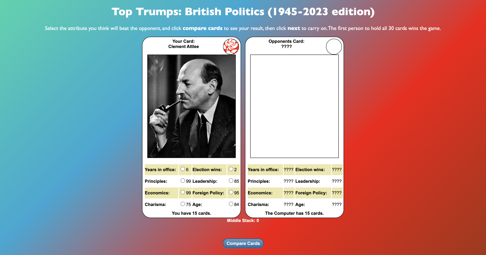
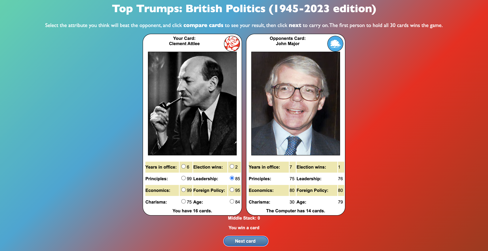

---

## CONTENTS  
  
* [UXD (User Experience Design)](#user-experience-ux)
  * [User Stories](#user-stories) 
* [Creation process (Strategy -> Surface)](#creation-process)
  * [Wireframes](#wireframes)
* [Design](#design)
  * [Colour Scheme](#color-scheme)
  * [Typography](#typography)
  * [Imagery](#imagery)
* [Page Features](#page-features)
  * [Title](#title)
  * [Hero-Image](#hero-image) 
* [Tablet & Mobile View](#tablet--mobile-view)
  * [Desktop, Tablet & Mobile Differences](#desktop-tablet--mobile-differences)
  * [Tablet View](#tablet-view-ipad-miniipad-prosurface-pro)
  * [Mobile View](#mobile-view-iphone-5iphone-seiphone-xriphone-12-pro)
* [Future Features](#future-features)
* [Technologies Used](#technologies-used)
  * [Languages Used](#languages-used)
  * [Frameworks, Libraries, Technologies & Programs Used](#frameworks-libraries-technologies--programs-used)
* [Deployment](#deployment)
  * [How to deploy](#how-to-deploy)
* [Testing](#testing)
  * [HTML Validation using W3C Validation](#html-validation-using-w3c-validation)
  * [CSS Validation using W3C Validation](#css-validation-using-w3c-validation)
  * [JS Validation using Beautify Tools](#js-validation-using-beautify-tools)
  * [Lighthouse scores via Chrome Developer Tools](#lighthouse-scores-via-chrome-developer-tools)
  * [Bugs & Fixes](#bugs--fixes)
  * [Unsolved Bugs](#unsolved-bugs)
* [Credits](#credits) 

  
---    

## User Experience (UX)  
  
### **User Stories**  

### **Primary Goal**  
  
Top Trumps: British Politics (1945-2023 edition) aims to be a fun game for those who either love politics or want a fun way to learn key figures of modern British politics.

### **Visitor Goals** 

Visitors will be from all different backgrounds, and thus it is a goal of the website to be straight to the point and easy to use for those who wish to play the game. The site is designed to be responsive to allow visitors to view it from a range of devices. The basic information is easily accessible.  

### **First Time Visitor**
  - A user can read the instructions of the game as it is located at the top of the page, and is one of the first things a user will see.
  - Directly below the instructions is the actual game so users can get stuck in as soon as they wish.

### **Returning & Frequent Visitor**  
  - A user can check the attributes of each card after doing some research and guess why the attribute was given.

--- 

## Creation Process  
  
### **1. Strategy**  

- I wanted a fun political-themed game. Top Trumps was selected as you can compare a number of politicians and their attributes; Top Trumps not only allows, but requires a lot of "characters" to be added into the game or else the game won't function. 
- As 30 cards - and therefore 30 people or "characters" were required, I added all the political leaders from 1945 till 2023, which is the year when the game was made. This includes all the party leaders of the Conservative Party and Labour Party as they have been the two political parties in power in Britain since 1945. I've also added the three reiging Monarchs during this period. I left out any 'acting' leader (those who lead a political party while a new, permanenet leader was found - an example is Margaret Beckett, who was acting leader of the Labour Party when the previous leader, John Smirth, died suddenly of a heart attack in 1994 - Beckett was replaced by Tony Blair after a leadership contest that same year. Though she was leader, she was only 'defacto' leader, hence left out).
- The attributes are based on the politician's record to date, rather than at the height of their career. One of the attributes has been rounded up in most cases - those who were in power and the attribute 'Years in Office'.   
- Information about this site is to be transparent and simple.  

  

### **2. Scope**  

The site will be available on a wide range of devices due to the varied range of people visiting the site. A range of visitors will be there for different reasons, but will want the same information - how to play the game. The site provides a comfortable, no-fuss approach which doesn't have endless amounts of information. The instructions are there and then the game is just below.

- The site is to contain only essential information, presented in a similar fashion and layout.   
- Text is clear and legible on any sized device. 
- For future development, the attributes on the cards can be updated, as some of the politicans age and perhaps have success or failure in their political careers.
  

### **3. Structural**  

The structure was simple:
- The instructions at the top of the and the game belwo the instructions.

  
### **4. Skeleton**  

The site was developed to be simple, clear, and familiar.  

- For the landing page, you have the page title at the top, just below that the instructions, and then the actual game, with two cards next to each other.  

### Wireframes  

Wireframe - Homepage & Mobile Desktop
  

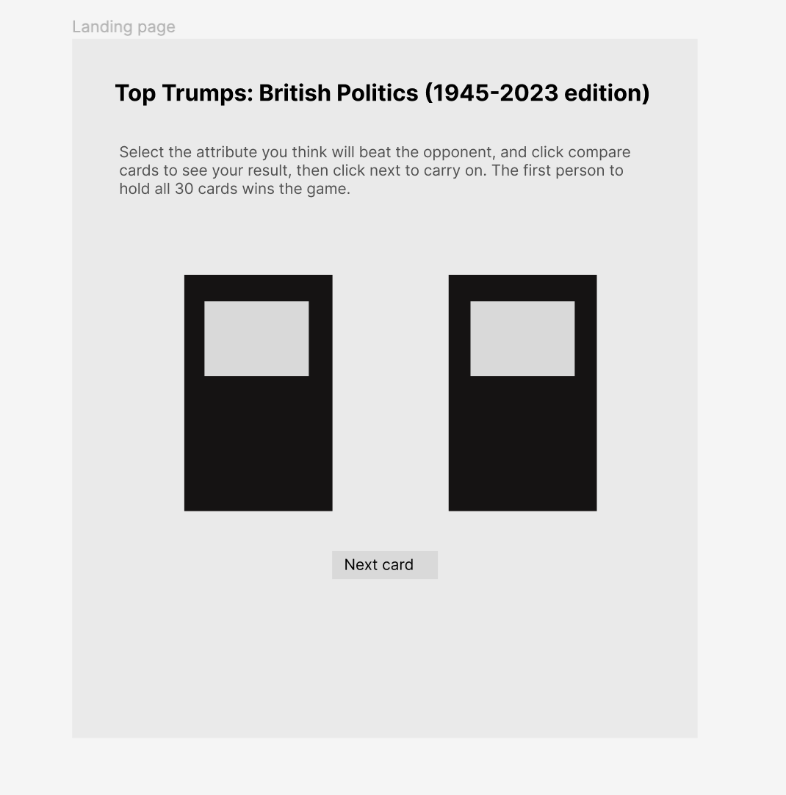

 

### **5. Surface**  

 A design was created that allowed players to read the instruction and play the game.   
 - A red and blue gradient linear background was added to contrast with the cards - red and blue was chosen because red is the colour of the Labour Party, blue being the colour of the Conservative Party.  
- The cards are white to contract with the background. Every other line in the attributes section is a light yellow to make them more distinguished.  
- The font is Gill Sans. This was chosen for asthetic reasons, it suites the site.  

Overall, the design intends to make the website seem welcoming, non-threatening and easily accessible.  

### **6. Algorithm** 
 The algorithm is designed to allow each player (the person playing and the computer) to start the game with 15 cards - the aim of the game is for either the player or the computer to win all 30 cards. This is achieved by the player 1 (a person) selecting an attribute they believe will be higher than the selected attribute the card player 2 (the computer) has. In each scenario, the person can see their card but won't be able to see the computer's card until they select an attribute and clicks the 'Compare Cards' button - this triggers th eevent where the computer's card is revealed, and the deck is adjusted in three ways depending on the selected attribute:
 -If player 1's selected attribute is higher, the deck is adjusted to add a card to their deck.
 -If player 2's selected attribute is higher, the deck is adjusted to add a card to their deck.
 -If player 1's selected attribute is the same as player 2's attribute on their card, the middle stack will add both player 1 and player 2's cards.

 In the last instance, the winner of the next round gains the cards from the middle stack and the total is adjusted - if there is a draw again then the loop repeats until there is player who wins the cards from the middle stack. 

 The game is goes on this continious loop until a player has 30 cards in their deck. In this instance, the person playing will be informed if they won or lost, and the button 'Play again' will appear, allowing them to restart the game.

 In order to make this a reality, the game consists of two js files: tt_queue.js and tt_game.js.

The tt_queue.js file contains a class named TopTrumpQueue which has several methods that are responsible for maintaining the deck of cards, shuffling, and drawing cards. The constructor function initializes some variables, including an array to hold the cards, the total number of cards in the deck, and a placeholder variable for a dequeued card. The enqueue method is used to add a new card to the deck, the getSize method is used to get the total number of cards in the deck, and the dequeue method is used to remove a card from the deck and return it. The shuffle method swaps two cards in the array at random a large number of times to shuffle the deck.

The tt_game.js file contains a class named TopTrumpCard which is used to create an instance of a card with various properties. It also initializes some global variables used in the game, including content, result, endGame, noGo, noValue, you, player2, theDeck, player1Card, player2Card, ending, oppStack, yourStack, mainStack, g, i, j, and cardNum. It also includes two functions, draw and drawP1Card. The draw function checks the status of the game and displays information about the player's and computer's stacks. The drawP1Card function is responsible for drawing a card from the deck for player 1 and updating the card information displayed in the HTML file.

Overall, the code is a simple implementation of a Top Trumps card game using JavaScript. It creates a deck of cards, shuffles them, and allows the player to draw a card and compete against the computer's card. The game continues until one player has all the cards or until the player decides to end the game.

---   
  
  
## Design  

### **Color Scheme**  

The website is dominated by the background color scheme, which is red and blue to represent the Labour party and the Conservative Party - the red was given matching brown and the blue was given turqoise to give each colour more of a slow gradient transision. The cards are white to contrast with the background.
  
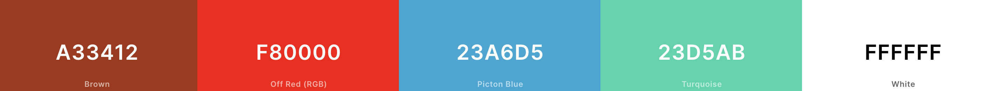  
  
The contrast ratio for my cards were acceptable according to the [WCAG](https://www.w3.org/WAI/WCAG21/Understanding/contrast-minimum.html) contrast ratio.
  
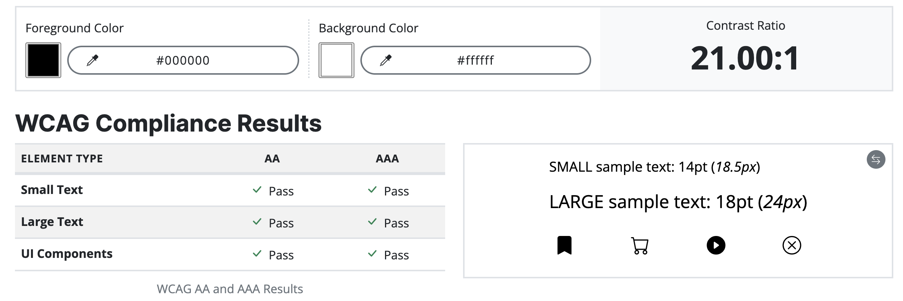  

  
[Adobe Color](https://color.adobe.com/create/color-contrast-analyzer) provided this fantastic resource for checking how accessible your colours are. I submitted my palette to the [Color Blind Safe](https://color.adobe.com/create/color-accessibility) check to find they passed this test also.  
  
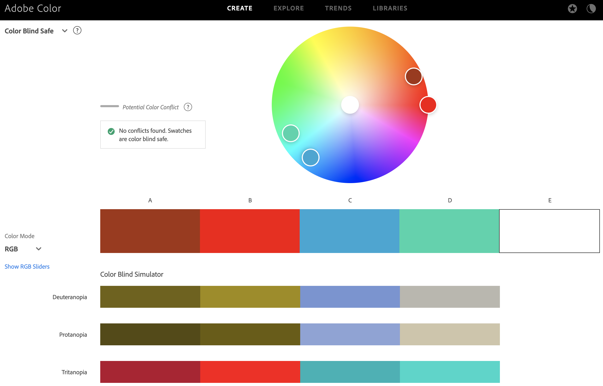
  
### **Typography**  
  
The font is Gill Sans. This was chosen for asthetic reasons, it suites the site.  
        
### **Imagery**  
  
The images of the website are the politicians included in the game.

---  
  

## Page Features  

### **Title**   

  

   

This remains the same across the three pages, in portrait/landscape and mobile/tablet/desktop view.
  
   

### **Hero Image**  

  

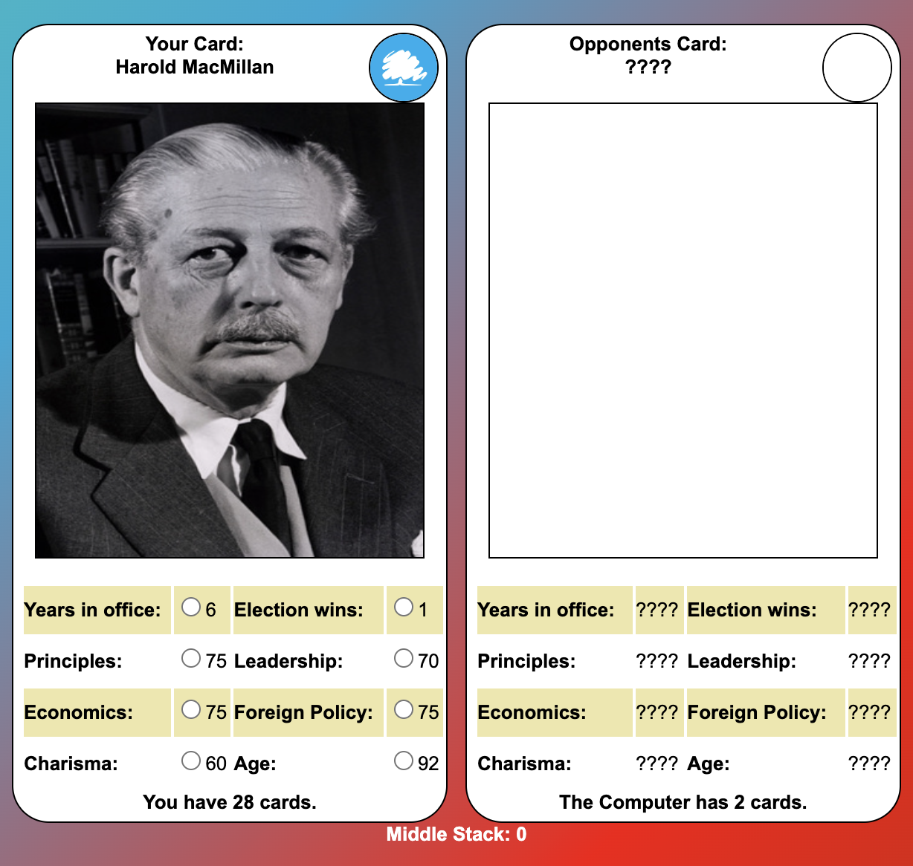  

The hero image is the character randomly generated for the user to start the game.
---   

## Tablet & Mobile View  
 
### **Desktop, Tablet & Mobile Differences**  
  
Below is what the game looks like on a on. different devices. Users will have to scroll down ever so slightly to click the compare button on tablet view.
  
### **Tablet View (iPad Mini/iPad Pro/Surface Pro)**  
  
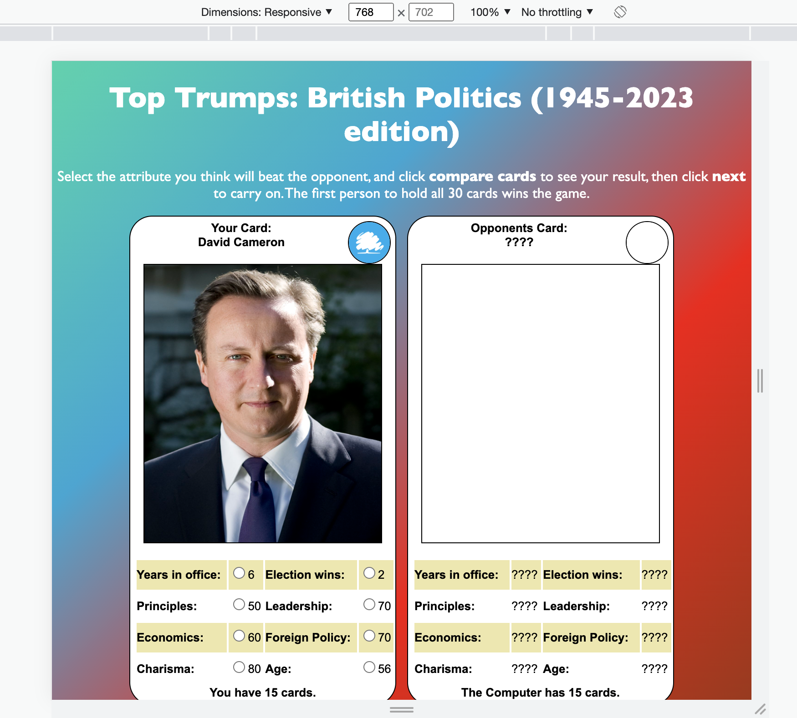
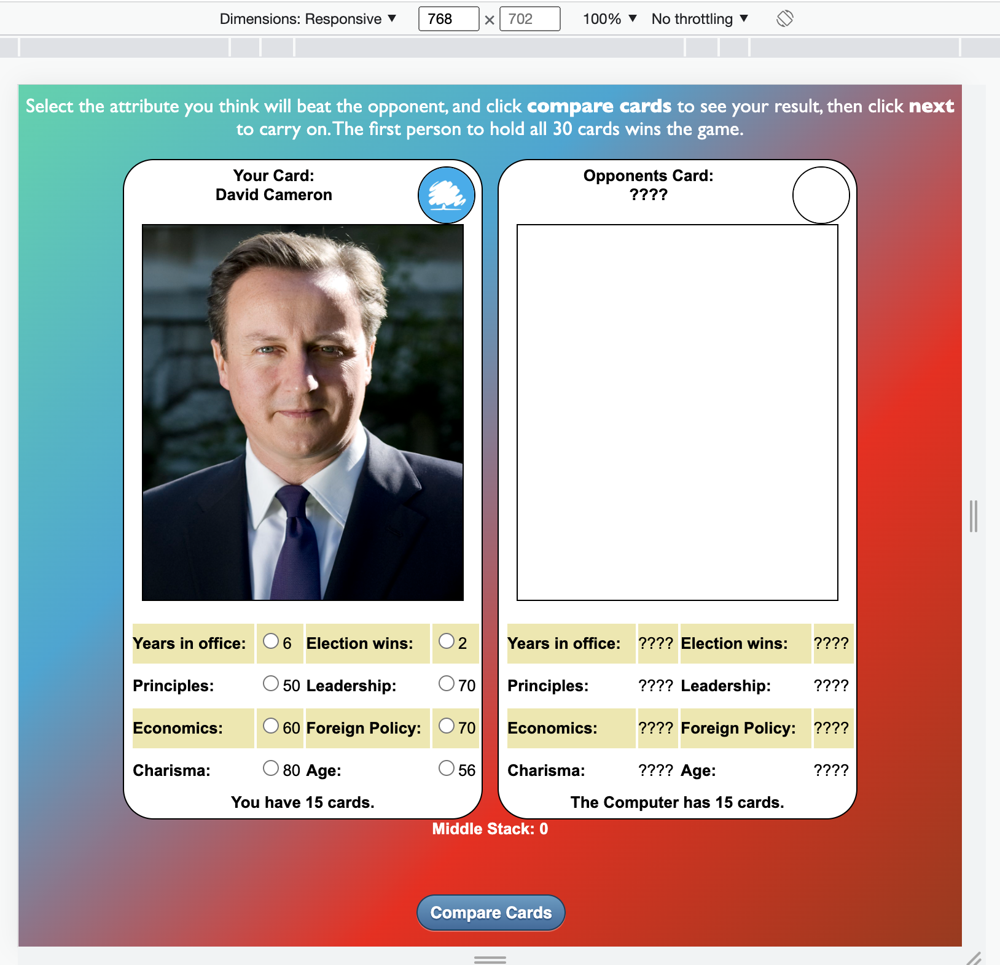

### **Mobile View (iPhone 5/iPhone SE/iPhone XR/iPhone 12 Pro)**  
  
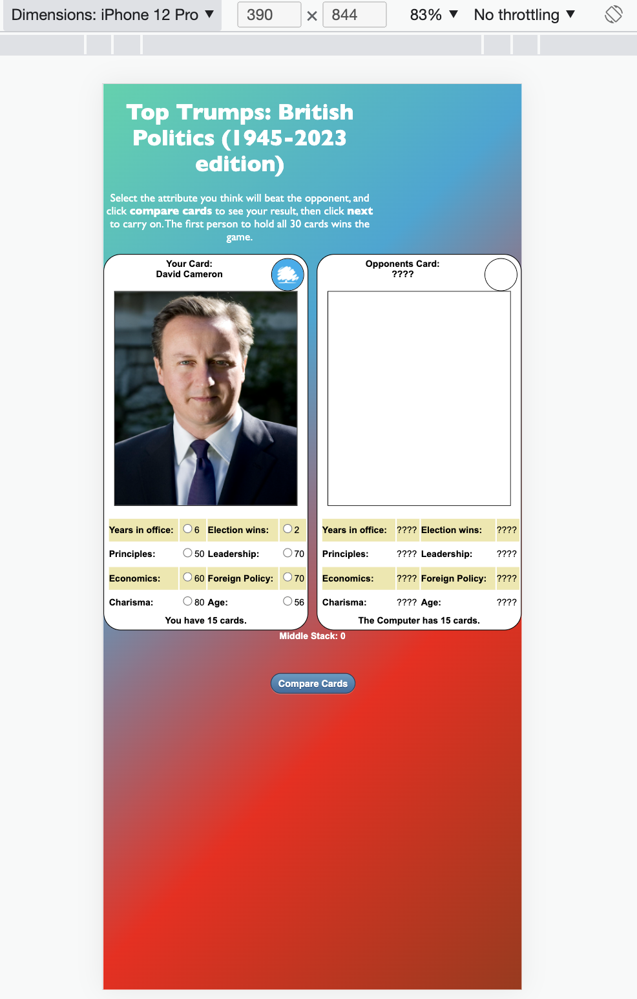

---  
                              

## Future Features  

- For future development, I would like to add the option to play with more than one person.
- Expand the amount of cards to add other major political figures (such as leaders from other British political parties).
  
---   
  

## Technologies Used    

### **Languages Used**   

- HTML5
- CSS3
- JavaScript

### **Frameworks, Libraries, Technologies & Programs Used**  

- GitHub - used to save and store all files for this website  
- Git - used for version control
- Google Dev Tools - to debug and for testing responsiveness 
- Google Lighthouse - for auditing the website
- W3C Validator - for validating the HTML and CSS code 
---   
 

## Deployment

### **How to deploy**  

GitHub was used to deploy the website. These were the steps taken to acheive this:  

1. Login to GitHub account
2. Navigate to the project repository, stokeydev_cardgame
3. Click the Settings button near the top of the page
4. In the left-hand menu, find and click on the Pages button
5. In the Source section, choose 'main' from the drop-down, select branch menu
6. Select 'root' from the drop-down folder menu
7. Click 'Save' and after a few moments the project will have been made live and a link is visible at the top of the page

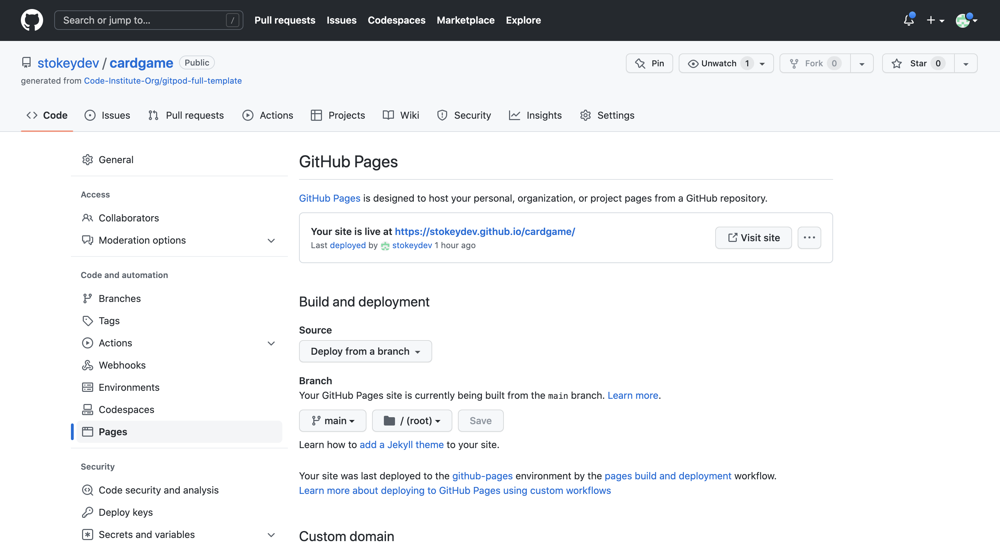 

---  
    

## Testing  

### **Initial testing plan**

I had planned for this site to be accessible and legible on all screen sizes. The user is viewing the site primarily for the menu options and parlour location and they needed to access this information with one click. I used Chrome Dev Tools to test, tweak and debug in the early stages. I deployed my site halfway through to test on real-world devices. These devices included:  
- HP Elite Desk 800
- iPad Pro 2022
- Huawei P30 Pro 
- iPhone 13
- Samsung Galaxy a8 tablet 
  
### **Testing**    

Testing took place throughout the entire build using Dev Tools on Chrome and on the above real-world devices. The browsers used were:  
- Chrome  
- Firefox   
- Safari  
  
The results of feature testing are as follows:  
  
| Page | Test | Pass/Fail |
| :----| :----| :--------:|
| Index  | Shuffle deck | Pass |
| Index  | Image of person corresponding to character | Pass |
| Index  | Politcal Party / Royal Standard image corresponds to character | Pass |
| Index  | Attributes corresponding to character | Pass |
| Index  | Higher attribute winning when clicking 'compare card' | Pass |
| Index  | Middle stack working when both attributes are the same | Pass |
| Index  | Middle stack passing onto deck of winner when attribute chosen is higher | Pass |
| Index  | The 'You have x cards' section correctly calculating amount accordign to events in the game | Pass |
| Index  | Seeing if the game ends when someone wins all of the cards along with corresponding 'you win' or 'you lose' message | Pass |

Further device testing took place in Dev Tools on:
  - iPhone 4/5/6/7/8
  - iPhone XR/ iPhone 12 Pro
  - Surface Pro 7
  - Nest Hub

 
### **HTML Validation using W3C Validation**  

Index/landing page HTML validation
  

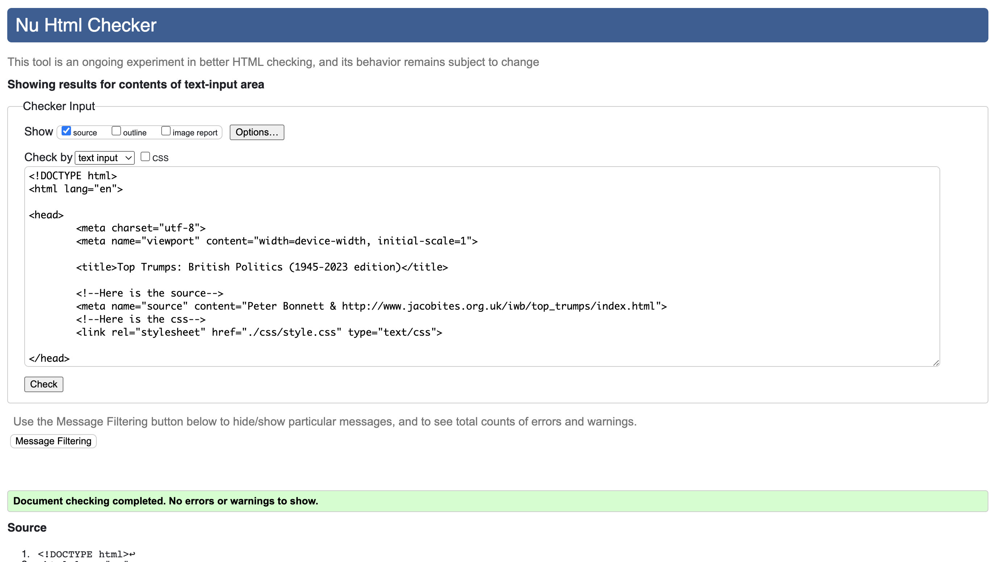

   

   

### **CSS Validation using W3C Validation** 

CSS validation
  

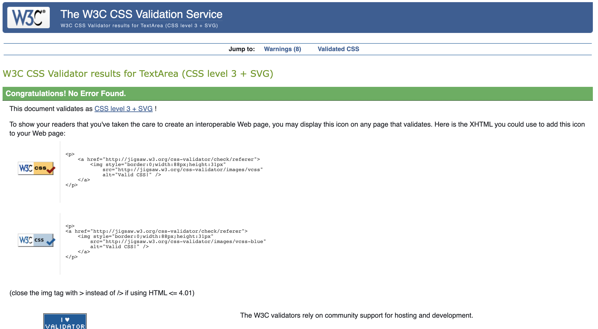

   

   

### **JS Validation using Beautify Tools** 

CSS validation
  

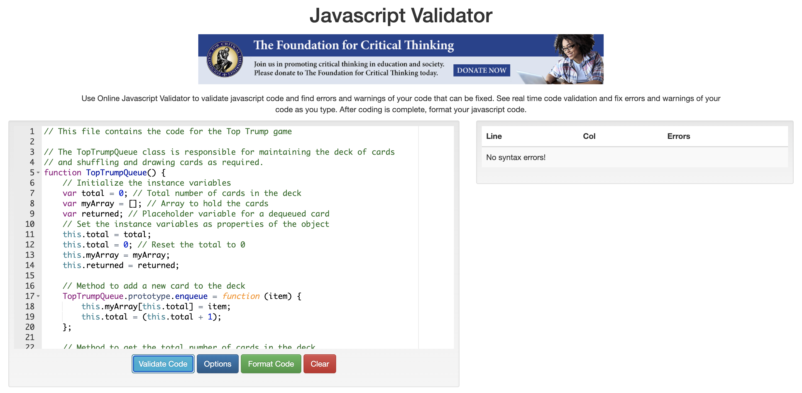

   

   

### **Lighthouse scores via Chrome Developer Tools**   
  
For Desktop   

Lighthouse audit for Index page
  

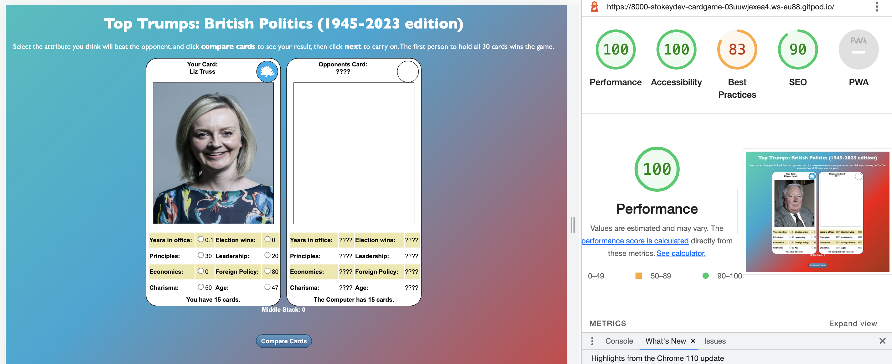

 

 
  
For Mobile   

Lighthouse audit for Index page - Mobile
  

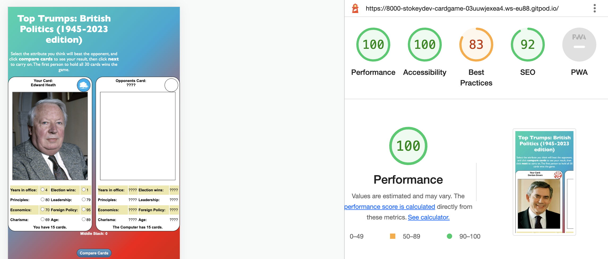

 
    
  
### **Bugs & Fixes**  
  
| Bug | Section | Fix |
| :----| :----| :--------:|
| Shuffling and drawing the deck of cards | Index/Home page | tt_que.js was created to maintain the cards by allowing the shuffling and drawing the deck of cards. |
| Variables | Index/Home page | tt_que.js was created to maintain the cards by initialising the instance variables and setting the instance variables as properties of the object. |
| Counting the cards | Index/Home page | In tt_que.js, a way to get the total number of cards in the deck was added. |
| Shuffling the deck | Index/Home page | In tt_que.js, a way to shuffle the deck was added. |

### **Unsolved Bugs** 

- The text sticks to half the page when on mobile view. I wasnt able to resolve this issue. It's awkard but doesn't get in the way of playing the game.
- When I added bootstrap the card structure would overflow and I wasn't able to resolve this issue, hence why bootstrap wasn't added.

---  

## Credits  
  
### **Content References**

- [Code Institute](https://codeinstitute.net/ie/) for their HTML/CSS and Javascript learning material.
- [W3Schools](https://www.w3schools.com/) for additional learning material.
- [MD Boostrap](https://mdbootstrap.com/docs/standard/navigation/footer/) for the footer, history timeline, and the hamburger navigation bar.
- [Peter Bonnett](http://www.jacobites.org.uk/iwb/top_trumps/index.html) for the fisher yates shuffle method.
- [Kera Cudmore - Creating your First README](https://github.com/kera-cudmore/readme-examples) for README structure and Markdown guidance. 
  

### **Media References**  
  
- [Google](https://google.com/) for all images used for the cards. 

### **Acknowledgements** 
- I would like to acknowledge my mentor, Richey Malhotra, for his support, guidance and encouragement on this project.
- I would also like to thank my family and friends for testing my work and offering positive thoughts throughout the project.